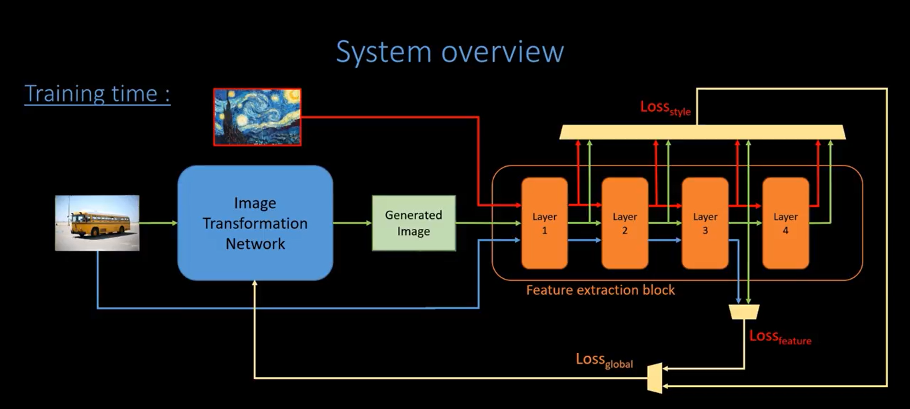

# Image Style Transfer
This project is a Keras implementation of [Perceptual Losses for Real-Time Style Transfer and Super-Resolution](https://arxiv.org/abs/1603.08155). This paper trains an image transformation network to perform style transfer as opposed to optimizing along the manifold of images as originally propsed by [Gatys et al.](https://arxiv.org/abs/1508.06576). All details can be found in our document.

### Model Overview:

### Results:

